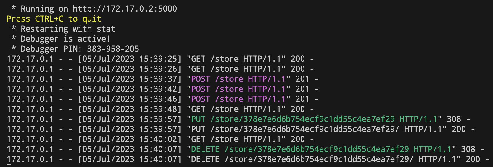

# Deployment

Let's build the image first

```bash
docker image build --tag flask-smorest-api . 
```

Then you could run the container on 
- port 5000 in detached mode
- with the current directory mounted in the container

> Tip:
> 
> This way, you can edit the code on your host machine and see the changes in the container without rebuilding the image.

```bash
cd app/

docker container run -dp 5000:5000 
                     -w /app \
                     -v "$(pwd):/app" \
                     flask-smorest-api
```

You can play around with [insomnia](https://insomnia.rest/) You can check your log with the following command

```bash
docker logs -f <container_id>
```




# References
- [REST API Crash Course](https://www.youtube.com/watch?v=qbLc5a9jdXo&ab_channel=CalebCurry)


